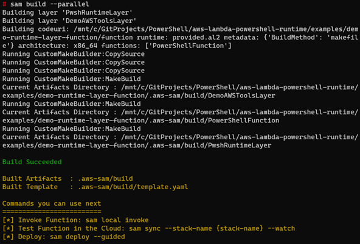

# Demo-runtime-layer-function

Demo to show PowerShell runtime functionality. 

This demo application uses AWS SAM to deploy the following:
1. PowerShell custom runtime based on ````provided.al2```` as a Lambda layer.
2. Lambda layer including select modules from [AWSTools for PowerShell](https://aws.amazon.com/powershell/).
    * ````AWS.Tools.Common````
    * ````AWS.Tools.S3````
3. Lambda function with three different handler options.

To build the custom runtime and the AWSTools for PowerShell layer, AWS SAM uses a Makefile. This downloads the specified version of PowerShell from https://github.com/PowerShell/PowerShell/releases/ and the AWSTools from https://sdk-for-net.amazonwebservices.com/ps/v4/latest/AWS.Tools.zip

Makefiles are not natively supported in Windows. When using Windows, you can use either [Windows Subsystem for Linux (WSL)](https://docs.microsoft.com/en-us/windows/wsl/about), [Docker Desktop](https://docs.docker.com/get-docker/) or native PowerShell.

### Pre-requisites: 
* [AWS Serverless Application Model (AWS SAM)](https://aws.amazon.com/serverless/sam/)
* If building on Windows:
   * [Windows Subsystem for Linux (WSL)](https://docs.microsoft.com/en-us/windows/wsl/about) *or*
   * [Docker Desktop](https://docs.docker.com/get-docker/) *or*
   * [PowerShell for Windows](https://docs.microsoft.com/en-us/powershell/scripting/install/installing-powershell-on-windows)

Clone the repository and change into the example directory
```
git clone ssh://git.amazon.com/pkg/Aws-lambda-powershell-runtime
cd examples/demo-runtime-layer-function
```
Use one of the *"Build"* options, A,B,C, depending on your operating system and tools.

### A. Build using Linux or WSL
Build the custom runtime, Lambda layer, and function packages using native Linux or WSL.
```
sam build --parallel
```


### B. Build using Docker
You can build the custom runtime, Lambda layer, and function packages using Docker. This uses a linux-based Lambda-like Docker container to build the packages. Use this option for Windows without WSL or as an isolated Mac/Linux build environment.

```
sam build --parallel --use-container
```


### C. Build using PowerShell for Windows
You can use native PowerShell for Windows to download and extract the custom runtime and Lambda layer files. This performs the same file copy functionality as the Makefile. It adds the files to the source folders rather than a build location for subsequent deployment with AWS SAM. Use this option for Windows without WSL or Docker.

```
.\build-layers.ps1
```


### Test the function locally

Once the build process is complete, you can use AWS SAM to test the function locally. 

```
sam local invoke
```
This runs the Lambda function locally using a Lambda-like environment and returns the function response which is the result of ````Get-AWSRegion````.


### Deploying to the AWS Cloud
Use AWS SAM to deploy the resources to your AWS account. Run AWS SAM ````-guided```` deploy to set the default parameters for the first deploy, for subsequent builds you can use ````sam deploy````. 
```
sam deploy -g
```
Enter a **Stack Name** and accept the remaining initial defaults.


AWS SAM deploys the infrastructure and outputs the details of the resources.


### View, edit, and invoke the function in the AWS Management Console

You can view, edit code, and invoke the Lambda function in the Lambda Console.
Navigate to the function specified in the ````sam deploy```` Outputs.

Using the built-in [code editor](https://docs.aws.amazon.com/lambda/latest/dg/foundation-console.html#code-editor), you can view the function code. 

This function installs the  ````AWS.Tools.Common```` module during the init process. The function handler runs and returns the output of ````Get-AWSRegion````.


To invoke the function, select the **Test** button. For more information on invoking a function with a test event, see the [documentation](https://docs.aws.amazon.com/lambda/latest/dg/getting-started-create-function.html#get-started-invoke-manually). 

You can see the results in the *Execution result* pane.

You can also view a snippet of the generated *Function Logs* below the *Response*. View the full logs in [Amazon CloudWatch Logs](https://docs.aws.amazon.com/AmazonCloudWatch/latest/logs). You can navigate directly via the *Monitor* tab.


### Invoke the function using the AWS CLI

From a command prompt invoke the function. Amend the ````--function-name```` and ````--region```` values for your function. This should return ````"StatusCode": 200```` for a successful invoke.

````
aws lambda invoke --function-name "aws-lambda-powershell-runtime-Function-6W3bn1znmW8G" --region us-east-1 invoke-result 
````

View the function results which are outputted to ````invoke-result````.

````
cat invoke-result
````


### Invoke the function using the AWS Tools for PowerShell

You can run the Lambda function and capture the response in a variable.
````
$result = Invoke-LMFunction -FunctionName "aws-lambda-powershell-runtime-Function-6W3bn1znmW8G" -Region "us-east-1"
````
The response is available in the ````Payload```` property of the ````$result```` object which can be read using the .NET ````StreamReader```` class.

````
$StreamReader = [System.IO.StreamReader]::new($Result.Payload)
$StreamReader.ReadToEnd()

````
This outputs the result of ````AWS-GetRegion```